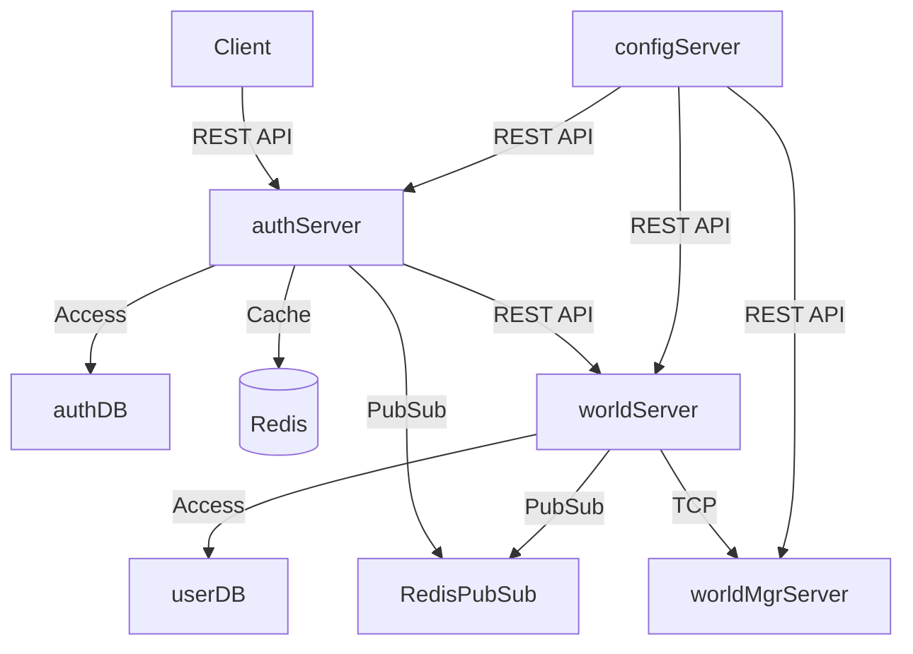

Inhee Game Server 
# 📡 Game Server Backend (TypeScript 기반 서버)

> **멀티 서버 기반 게임 서버 백엔드** 프로젝트로, 인증부터 월드서버 운영까지 모듈화된 아키텍처를 통해 고성능 실시간 처리를 지원합니다.  

## 🔧 기술 스택

- **Node.js** + **TypeScript**
- **Net 모듈 기반 서버<-서버 클라<->서버 TCP**
- **Net 모듈 기반 클라<->서버 UDP 통신 데드레커닝 구현예정**
- **Axios 모듈 기반 서버<-서버 클라<->서버 restApi 통신**
- **MySQL Table, SP Migration 처리**
- **Lua 스크립트를 통한 Redis 최적화 처리**
- **패킷 프로토 Google Protocol Buffers 적용**
- **PM2 프로세스 관리**
- **Jenkins -> deployScript -> 클라우드(AWS) 서버, DB CI/CD 배포 자동화**

---

## 🗂 서버 아키텍처 구성도 (Mermaid)

> 아키텍처는 실시간 유저 인증과 접속 분산, 설정 전파, Redis 캐시 및 Pub/Sub을 통한 메시징 구조로 설계되어 있습니다.

## 📎 참고

- 개발자는 실무 12년차 MO, 비동기MMO, 등의 게임 서버 아키텍처 및 
  성능 테스트 경험 보유 
  (추후 ELK, Prometheus & Grafana api 연동 및 대쉬보드 구현)
- 클라우드(AWS) 인프라 및 배포 자동화까지 구현된 End-to-End 프로젝트
- 서버 상세 설명은 [`Server/README.md`](./Server/README.md) 참고